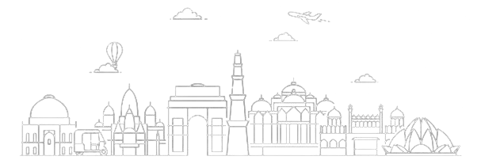

---

  <h1> Hi , I'm Pranav</h1>

Welcome to my favourite place! I'm a junior whose academic pursuits align with Artificial Intelligence & Data Science, but finds himself drawn towards web development, community building and open-source. Currently, I'm working as a DevRel at Decentraclasses, where we redefine education through decentralization, turn learning into a valuable asset. Moreover, I proudly serve as a President at The nameSpace community, largest community of tech enthusiasts within my university. 📈  
Fuelled by an insatiable curiosity, I thrive on continuous exploration and upskilling, always seeking to push the boundaries of my knowledge. Whether it's crafting elegant code, advocating for open-source principles, or fostering a vibrant tech community, I find my passion deeply rooted in the realms of web development, FOSS, and all things tech. When I'm not immersed in lines of code or engaged in tech discussions, you'll likely find me sweating it out at the gym, channeling that same energy into physical pursuits.🚀

- 🌱 I’m currently working as a **🥑DevRel @Decentraclasses**
   
- 🤝 I’m working on a **Scrum Project Management Tool for Agile Teams**
   
- 💬 Ask me anything about **Web Development**
     
- 📫 How to reach me :    
- 😄 My Linktree : 
     
- ⚡ Fun fact : I like to click pictures, check it out on 
- 👨‍💻 I love to attend Tech events/Meetups and make new connections.

  

<h2 align="center">Languages, Tools & Technologies</h2>

 

 
 
 

 

  

  

<h2 align="center">Profile Stats</h2>

   

  

 

   
<!--

 

 

-->

<!-- 

    
  

 -->

 
  Visitor Count 
  

&nbsp;

Regarding any issues, feel free to drop a mail at — <a href="mailto:pbarthwal90@gmail.com"><b>pbarthwal90@gmail.com</b></a>

